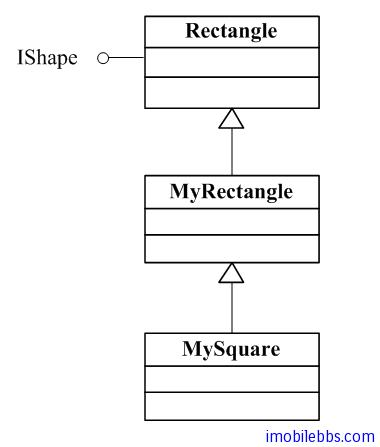
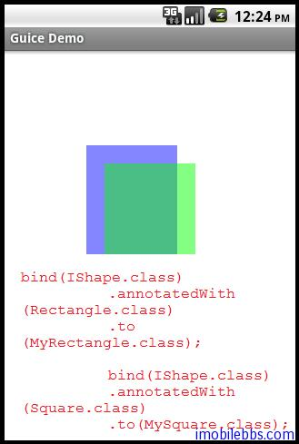

#Binding Annotations
有些情况需要将同一类型映射到不同的类实现，还是使用绘图的例子.

IShape, Rectangle, MyRectangle, MySquare, 有如下继承关系：



我们可能需要将 IShape 同时映射到 MyRectangle 和 MySquare ，这时可以使用 Binding [Annotation](http://download.oracle.com/javase/1.5.0/docs/guide/language/annotations.html) 来实现。 这时使用类型和 annotation (标注）可以唯一确定一个 Binding。Type 和 [annotation](http://download.oracle.com/javase/tutorial/java/javaOO/annotations.html) 对称为 Key（键）。

为了同时使用 MyRectangle 和 MySequare，我们定义两个 annotation，如下

```
import com.google.inject.BindingAnnotation;
import java.lang.annotation.Target;
import java.lang.annotation.Retention;
import static java.lang.annotation.RetentionPolicy.RUNTIME;
import static java.lang.annotation.ElementType.PARAMETER;
import static java.lang.annotation.ElementType.FIELD;
import static java.lang.annotation.ElementType.METHOD;

...
@BindingAnnotation
@Target({ FIELD, PARAMETER, METHOD })
@Retention(RUNTIME)
public @interface Rectangle {
}
...

@BindingAnnotation
@Target({ FIELD, PARAMETER, METHOD })
@Retention(RUNTIME)
public @interface Square {
}
```

定义了两个标注 @Rectangle, @Square, 至于 @BindingAnnotation，@Target，@Retention 你并不需要详细了解，有兴趣的可以参见 [Java Annotation tutorial](http://download.oracle.com/javase/tutorial/java/javaOO/annotations.html)

简单的说明如下：

+ @BindingAnnotation 通知这是一个 Binding Annotation，如果将多个个标注应用到同一个元素时，Guice 会报错。
+ @Target({FIELD, PARAMETER, METHOD})  表示这个标注可以应用到类成员变量，函数的参数或时方法。
+ @Retention(RUNTIME) 表示这个标注在程序运行时可以使用 Reflection 读取。

创建一个 BindingAnnotationsDemo 用来绘制两个图形：

```
public class BindingAnnotationsDemo extends Graphics2DActivity{

 @Inject @Rectangle IShape  shape1;
 @Inject @Square IShape  shape2;

 protected void drawImage(){

 /**
 * The semi-opaque blue color in
 * the ARGB space (alpha is 0x78)
 */
 Color blueColor = new Color(0x780000ff,true);
 /**
 * The semi-opaque green color in the ARGB space (alpha is 0x78)
 */
 Color greenColor = new Color(0x7800ff00,true);

 graphics2D.clear(Color.WHITE);
 graphics2D.Reset();

 SolidBrush brush=new SolidBrush(blueColor);

 graphics2D.fill(brush,shape1);
 AffineTransform at = new AffineTransform();
 at.translate(20, 20);
 graphics2D.setAffineTransform(at);
 brush=new SolidBrush(greenColor);
 graphics2D.fill(brush,shape2);

 }

}
```

使用标注将 shape1 绑定到 MyRectangle, shape2 绑定到 MySquare，对应的 Module 定义如下：

```
public class Graphics2DModule extends AbstractAndroidModule{

 @Override
 protected void configure() {

 bind(IShape.class)
 .annotatedWith(Rectangle.class)
 .to(MyRectangle.class);

 bind(IShape.class)
 .annotatedWith(Square.class)
 .to(MySquare.class);

 }
}
```



Inject 可以应用到 Field (成员变量）,Parameter (参数）或 Method (方法），前面的例子都是应用到 Field 上，如果应用到参数可以有如下形式：

```
@Inject
public IShape getShape(@Rectangle IShape shape){
...
}
```

如果你不想自定义 Annotation，可以使用 Guice 自带的 @Name 标注来解决同一类型绑定到不同实现的问题。

修改上面代码：

```
//@Inject @Rectangle IShape  shape1;
//@Inject @Square IShape  shape2;

@Inject @Named("Rectangle") IShape shape1;
@Inject @Named("Square") IShape shape2;
```

修改绑定如下：

```
//bind(IShape.class)
//.annotatedWith(Rectangle.class)
//.to(MyRectangle.class);

//bind(IShape.class)
//.annotatedWith(Square.class)
//.to(MySquare.class);

bind(IShape.class)
 .annotatedWith(Names.named("Rectangle"))
 .to(MyRectangle.class);
bind(IShape.class)
 .annotatedWith(Names.named("Square"))
 .to(MySquare.class);
```

这种方法简单，但编译器无法检测字符串，比如将 ”Square” 错写为 ”Sqare”，编译器无法查出这个错误，此时到运行时才可能发现 shape2 无法注入，因此建议尽量少用 Named.