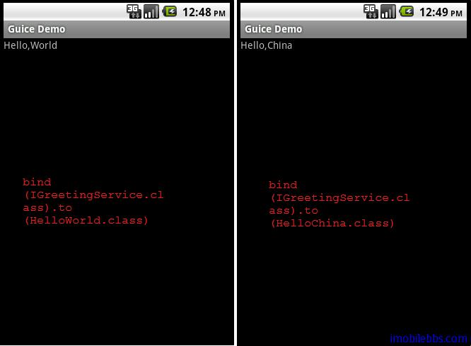

#Bindings 概述
一个应用中类于类之间的依赖关系可能非常复杂，创建于个类实例，需要先创建类所依赖的类的示例，而创建所依赖类的实例，这些类又可能依赖其它类，以此类推。因此在创建一个类实例时，你正在需要创建的是一个对象图对象 (Object Graph)。

手工创建 Object Graph 是一个非常繁琐而且容易出错的过程，并且很难对代码进行测试，而 Guice 或 Roboguice 可以帮助你创建 Object Graph，所要做的工作是配置类和类之间的依赖关系。

模块 (Modules) 是 Guice 构造 Object Graph 的基本构造块，Guice中构造 object Graph 的工作有被称为 ”Injector” 的类来完成。

Guice 在模块为 AbstractMoudule 的子类，而 RoboGuice 在模块为AbstractAndroidModule 的子类。RoboGuice 利用 Injector 来创建所依赖的对象，而 Injector 为参照 Module 中定义的 Bindings 来构造类于类之间的关系图。

打个比方，如果你熟悉 make file 或是其它 Build 系统（如 wix) 。你使用 makefile 定义好需编译的对象所依赖的源码文件，这些源码由可能依赖其它库或头文件等。makefile 定义的这些依赖关系对应到 Roboguice 中为模块中定义的 bindings 。

使用 make 编译某个目标程序 (Target), make 会查看 makefile 中的依赖关系，依次先编译被依赖的对象直到最终编译 Target。对应到Roboguide（Guice)为 Injector 创建某个对象，它会根据定义的Bindings 首先创建那些被依赖的对象，直到创建所需对象。

在 HelloWorld 例子中，我们没有看到 Injector 的直接使用，这是因为 RoboGuice 替我们调用了 Injector 来创建 IGreetingService 对象。

如果在某些情况下，如果你想直接使用 Injector ,可以使用RoboActivity 的 getInjector().

比如修改 GuiceDemo，去掉 @Inject IGreetingService greetingServce 而使用 Injector 的 getInstance 来创建IGreetingService 实例。

```

public class GuiceDemo extends RoboActivity  {

 @InjectView (R.id.hello) TextView helloLabel;
 //@Inject IGreetingService greetingServce;

 @Override
 public void onCreate(Bundle savedInstanceState) {
 super.onCreate(savedInstanceState);
 setContentView(R.layout.main);

 Injector injector=getInjector();
 IGreetingService greetingServce
 =injector.getInstance(IGreetingService.class);
 helloLabel.setText(greetingServce.getGreetings());
 }

}

```

Module 中的还是绑定到 HelloChina.

```

public class GreetingModule extends AbstractAndroidModule{

 @Override
 protected void configure() {
 //bind(IGreetingService.class).to(HelloWorld.class);
 bind(IGreetingService.class).to(HelloChina.class);

 }

}

```




Injector 的工作就是构造 Object Graph，当你调用 getInstance 来构造某个类型的对象时，Injector 会自动根据类之间的依赖关系创建所需类的实例。

定义类之间的依赖关系的方法是通过扩展 AbstractAndroidModule，重载其 configure 方法。在 configure 方法中定义各种 Bindings。 这些方法同时也做类型检测，如果使用的类型不正确，编译器将给出错误。

绑定 Bindings 可以有下面几种类型：

+ Linked bindings
+ instance bindings
+ @provider methods
+ provider bindings
+ constructor bindings
+ untargetted bindings
+ built-in bindings
+ just-in-time bindings
+ providers 等

后面就逐个介绍这些 bindings ，这些 bindings 是通用的和 Android平台相关性不大，可以同时用于 Java EE ，Java SE 平台，RoboGuice 提供了于 Android 平台相关的 dependency injector , 后面也有详细介绍。