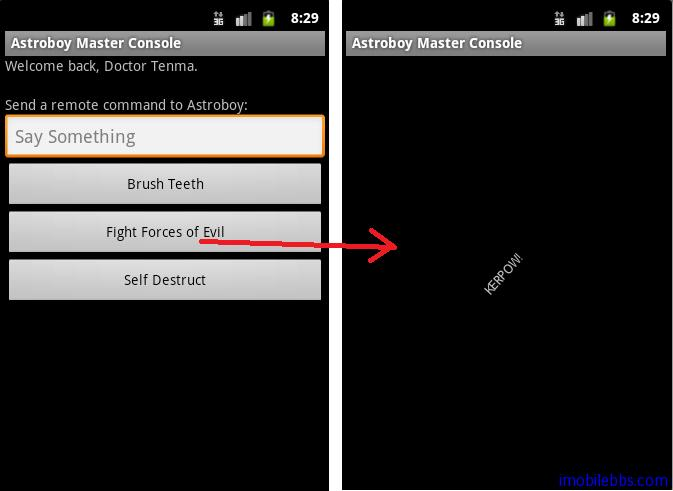

#綜合示例 Astroboy

前面介紹了 RogoGuice2.0 的基本用法，其它使用可以參見 RoboGuice1.1 開發指南，2.0中提供了對 Fragment，View（自定義View 中使用注入）的支持，本博客不再一一介紹。

本例使用的是 RoboGuice 開發包中的簡單示例 Astroboy (阿童木）。涉及的使用 RoboGuice2.0 的一些常用方法。

[本例下載（Eclipse項目）](http://www.imobilebbs.com/download/android/Astroboy.zip)。

下面對項目中 RoboGuice2 的使用進行解釋。因為本例沒使用自定義綁定，所以無需使用 res/values/roboguice.xml 定義 Module. 如有自定義模塊，可以參見 [Android RoboGuice2 使用指南(2): 第一個例子 Hello World](http://www.imobilebbs.com/wordpress/?p=3111)。

1. 類 Astroboy

```
// There's only one Astroboy, so make it a @Singleton.
// This means that there will be only one instance of Astroboy in the entire
// app.
// Any class that requires an instance of Astroboy will get the same instance.
// This also means this class needs to be thread safe, of course
@Singleton
public class Astroboy {

	// Because Astroboy is a Singleton, we can't directly inject the current
	// Context since the current context may change depending on what activity
	// is using Astroboy
	// at the time. Instead we use the application context.
	// Vibrator is bound to context.getSystemService(VIBRATOR_SERVICE) in
	// DefaultRoboModule.
	// Random has no special bindings, so Guice will create a new instance for
	// us.
	@Inject	Application application;
	@Inject	Vibrator vibrator;
	@Inject	Random random;

	public void say(String something) {
		// Make a Toast, using the current context as returned by the Context
		// Provider
		Toast.makeText(application, "Astroboy says, \"" + something + "\"",
				Toast.LENGTH_LONG).show();
	}

	public void brushTeeth() {
		vibrator.vibrate(
				new long[] { 0, 200, 50, 200, 50, 200, 50, 200, 50, 200, 50,
						200, 50, 200, 50, 200, 50, 200, 50, 200, 50, 200, 50, },
				-1);
	}

	public String punch() {
		final String expletives[] = new String[] { "POW!", "BANG!", "KERPOW!",
				"OOF!" };
		return expletives[random.nextInt(expletives.length)];
	}
}

```

程序中只希望使用一個 Astroboy 實例，因此可以使用 @Singleton 標註，此後任何使用

@Inject Astroboy astroboy;

注入的 Astroboy 都會指向同一個實例，這也是符合 [Singleton 設計模式的](http://www.imobilebbs.com/wordpress/?p=2540)。

@Inject Application application; 注入 Application 實例。參見[Android RoboGuice 使用指南(15):Inject Context](http://www.imobilebbs.com/wordpress/?p=2558)

@Inject Vibrator vibrator; 注入 Android Vibrator 實例，參見[Android RoboGuice 使用指南(16):Standard Injection](http://www.imobilebbs.com/wordpress/?p=2563)

@Inject Random random; 對於普通的 Java 類型（POJO），如果該類具有 [預設構造函數](http://www.imobilebbs.com/wordpress/?p=2537)（不帶參數的等），也可以使用 RoboGuice 自動注入實例。

因此當 Astroboy 創建時，RoboGuice 自動為 application, vibrator, random 創建實例，無需使用 new 或參數傳入來構造它們。

2. 類 AstroboyRemoteControl

```
/**
 * A class to control Astroboy remotely.
 *
 * This class uses the current context, so we must make it @ContextSingleton.
 * This means that there will be one AstroboyRemoteControl for every activity or
 * service that requires one. Note that we actually ask for the Activity, rather
 * than the Context (which is the same thing), because we need access to some
 * activity-related methods and this saves us from having to downcast to an
 * Activity manually.
 *
 * It also asks RoboGuice to inject the Astroboy instance so we can control him.
 *
 * What you'll learn in this class - What @ContextScope means and when to use it
 * - How to inject an Activity instead of a Context (which is really the same
 * thing) - How to use RoboGuice's convenient and flexible logging facility, Ln.
 */
@ContextSingleton
public class AstroboyRemoteControl {

	// The Astroboy class has been decorated with @Singleton, so this instance
	// of Astroboy will be the same instance used elsewhere in our app.
	// Injecting an Activity is basically equivalent to "@Inject Context context",
	// and thus also requires @ContextScope. If you wanted, you could also
	// @Inject Application, Service, etc. wherever appropriate.
	@Inject	Astroboy astroboy;
	@Inject	Activity activity;

	public void brushTeeth() {
		// More info about logging available here:
		// http://code.google.com/p/roboguice/wiki/Logging
		Ln.d("Sent brushTeeth command to Astroboy");
		astroboy.brushTeeth();
	}

	public void say(String something) {
		Ln.d("Sent say(%s) command to Astroboy", something);
		astroboy.say(something);
	}

	public void selfDestruct() {
		Toast.makeText(
				activity,
				"Your evil remote control has exploded! Now Astroboy is FREEEEEEEEEE!",
				Toast.LENGTH_LONG).show();
		activity.finish();
	}
}

```

與 Singleton 類似的一個 Scope 標註為 @ContextSingleton ，它表示對於每個 Activity 實例有一個實例，不同的 activity 對應不同的實例。

@Inject Astroboy astroboy; 注入同一個 Astroboy 實例（Singleton）。

@Inject Astroboy astroboy; 注入對應的 Activity 實例。

3. 類 AstroboyMasterConsole

```
/**
 * This activity uses an AstroboyRemoteControl to control Astroboy remotely!
 *
 * What you'll learn in this class: - How to use @InjectView as a typesafe
 * version of findViewById() - How to inject plain old java objects as well
 * (POJOs) - When injection happens - Some basics about injection, including
 * when injection results in a call to an object's default constructor, versus
 * when it does something "special" like call getSystemService()
 */
@ContentView(R.layout.main)
public class AstroboyMasterConsole extends RoboActivity {

	// Various views that we inject into the activity.
	// Equivalent to calling findViewById() in your onCreate(), except more
	// succinct
	@InjectView(R.id.self_destruct)	Button selfDestructButton;
	@InjectView(R.id.say_text)	EditText sayText;
	@InjectView(R.id.brush_teeth)	Button brushTeethButton;
	@InjectView(tag = "fightevil")	Button fightEvilButton; // we can also use tags if we want

	// Standard Guice injection of Plain Old Java Objects (POJOs)
	// Guice will find or create the appropriate instance of AstroboyRemoteControl for us
	// Since we haven't specified a special binding for AstroboyRemoteControl,
	// Guice will create a new instance for us using AstroboyRemoteControl's default constructor.
	// Contrast this with Vibrator, which is an Android service that is
	// pre-bound by RoboGuice.
	// Injecting a Vibrator will return a new instance of a Vibrator obtained by
	// calling
	// context.getSystemService(VIBRATOR_SERVICE). This is configured in
	// DefaultRoboModule, which is
	// used by default to configure every RoboGuice injector.
	@Inject	AstroboyRemoteControl remoteControl;
	@Inject	Vibrator vibrator;

	@Override
	public void onCreate(Bundle savedInstanceState) {
		super.onCreate(savedInstanceState); // @Inject, @InjectResource, and
											// @InjectExtra injection happens
											// during super.onCreate()

		sayText.setOnEditorActionListener(new OnEditorActionListener() {
			public boolean onEditorAction(TextView textView, int i,
					KeyEvent keyEvent) {

				// Have the remoteControl tell Astroboy to say something
				remoteControl.say(textView.getText().toString());
				textView.setText(null);
				return true;
			}
		});

		brushTeethButton.setOnClickListener(new OnClickListener() {
			public void onClick(View view) {
				remoteControl.brushTeeth();
			}
		});

		selfDestructButton.setOnClickListener(new OnClickListener() {
			public void onClick(View view) {

				// Self destruct the remoteControl
				vibrator.vibrate(2000);
				remoteControl.selfDestruct();
			}
		});

		// Fighting the forces of evil deserves its own activity
		fightEvilButton.setOnClickListener(new OnClickListener() {
			public void onClick(View view) {
				startActivity(new Intent(AstroboyMasterConsole.this,
						FightForcesOfEvilActivity.class));
			}
		});

	}

}

AstroboyMasterConsole 為主Activity，要使用RoboGuice，則Activity需從RoboActivity派生，其它如Service，Fragment等可以參見Android RoboGuice 使用指南(13):RoboGuice 功能描述。

@InjectView(R.id.self_destruct) Button selfDestructButton;  注入View實例，功能同findViewById。 它的另外一種方法是使用Tag，如

@InjectView(tag = “fightevil”) Button fightEvilButton ，功能一樣。

這個類使用@ContentView(R.layout.main) 為Activity指明ContentView，無需再調用setContentView.

4. 類FightForcesOfEvilActivity

/**
 * Things you'll learn in this class: - How to inject Resources - How to use
 * RoboAsyncTask to do background tasks with injection - What it means to be a @Singleton
 */
public class FightForcesOfEvilActivity extends RoboActivity {

	@InjectView(R.id.expletive)	TextView expletiveText;

	// You can also inject resources such as Strings, Drawables, and Animations
	@InjectResource(R.anim.expletive_animation)	Animation expletiveAnimation;

	// AstroboyRemoteControl is annotated as @ContextSingleton, so the instance
	// we get in FightForcesOfEvilActivity will be a different instance than
	// the one we got in AstroboyMasterConsole
	// @Inject AstroboyRemoteControl remoteControl;

	@Override
	protected void onCreate(Bundle savedInstanceState) {
		super.onCreate(savedInstanceState);
		setContentView(R.layout.fight_evil);

		expletiveText.setAnimation(expletiveAnimation);
		expletiveAnimation.start();

		// Throw some punches
		for (int i = 0; i < 10; ++i)
			new AsyncPunch(this) {
				@Override
				protected void onSuccess(String expletive) throws Exception {
					expletiveText.setText(expletive);
				}

				// We could also override onException() and onFinally() if we
				// wanted

			}.execute();

	}

	// This class will call Astroboy.punch() in the background
	public static class AsyncPunch extends RoboAsyncTask<String> {

		// Because Astroboy is a @Singleton, this will be the same
		// instance that we inject elsewhere in our app.
		// Random of course will be a new instance of java.util.Random, since
		// we haven't specified any special binding instructions anywhere
		@Inject	Astroboy astroboy;
		@Inject	Random random;

		public AsyncPunch(Context context) {
			super(context);
		}

		public String call() throws Exception {
			Thread.sleep(random.nextInt(5 * 1000));
			return astroboy.punch();
		}
	}
}

```

@InjectResource(R.anim.expletive_animation) Animation expletiveAnimation; 注入資源，可以參見 [Android RoboGuice 使用指南(18):Inject Resources](http://www.imobilebbs.com/wordpress/?p=2573)。

從代碼中可以看出使用 RoboGuice 注入可以簡化程序，運行結果如下圖：



