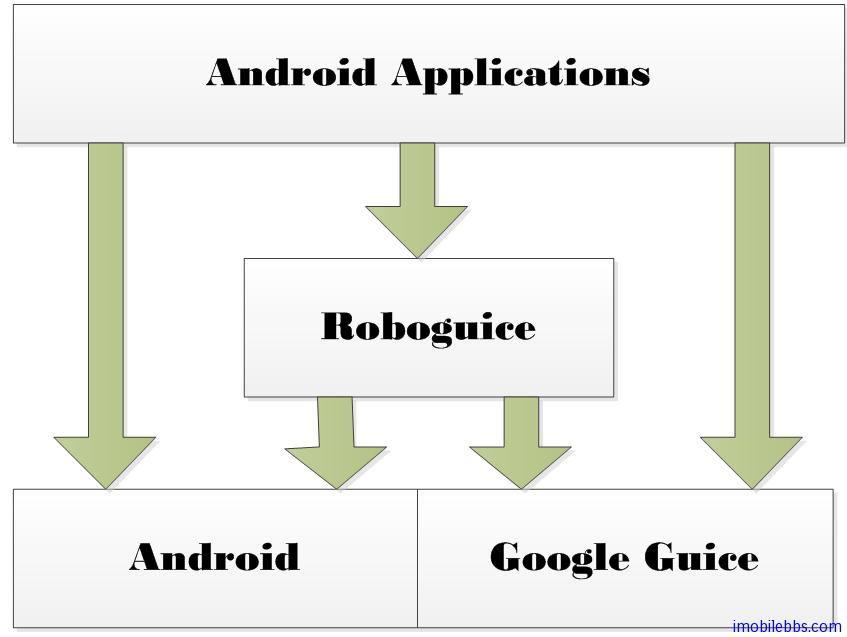
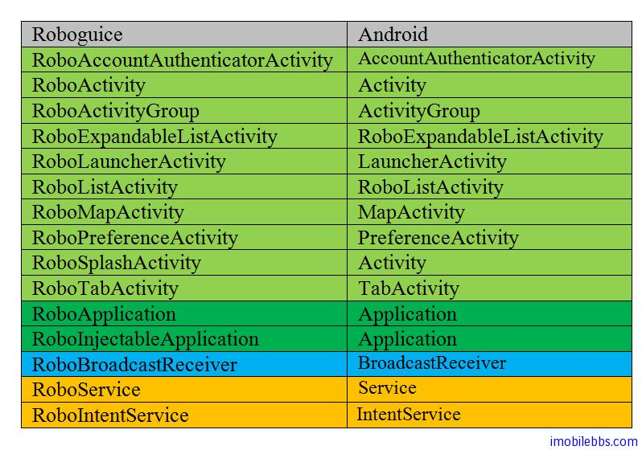

#RoboGuice 功能描述

前面在 [Android RoboGuice 使用指南(1):概述](http://www.imobilebbs.com/wordpress/?p=2480) 对应 Roboguice 做了简要的介绍，之后介绍了 Google Guice 的基本用法，Roboguice 是基本 Android 和 Google Guice 开发的适用于 Android 平台的 Dependency Injection 开发包，下图为使用 Roboguice 开发应用的基本框图：

Android 应用程序可以直接使用 Google Guice 来为普通类进行注入操作，而对和 Android 平台相关的类如 Activity，Context，Service，View 等可以使用 Roboguice 进行注入操作。

在例 [Android RoboGuice 使用指南(2):第一个例子 Hello World](http://www.imobilebbs.com/wordpress/?p=2486) 介绍了使用 RoboGuice 开发的步骤，原先从 Activity 派生的类一般需要改成从 RoboActivity 派生，并添加从 RoboApplication 派生的类作为 Application 应用的 Application 类，详细的对应表如下：

RoboGuice 支持的标记如下：

+ @ContextScoped : 表示 Scope 为 Context 范围 Android RoboGuice 使用指南(11)： Scopes
+ @InjectExtra :  Intent 的 getExtra 的注入标记
+ @InjectPreference: 注入 Preference
+ @InjectResource: 注入 Resource，如 drawable, icon 等
+ @InjectView:  注入 View
+ @Inject：  Guice 标记，可以注入 Android 平台支持的各种服务，比如 LocationManager 等。
+ @SharedPreferencesName: SharedPreferences 名称等

此外，RoboGuice 还提供了简单的消息 publish/subscribe 机制，以及可以支持 Dependency Injection 的 RoboThread, RoboAsyncTask ,RoboLooperThread 等，将在后面的文章详细说明。