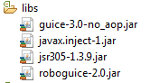
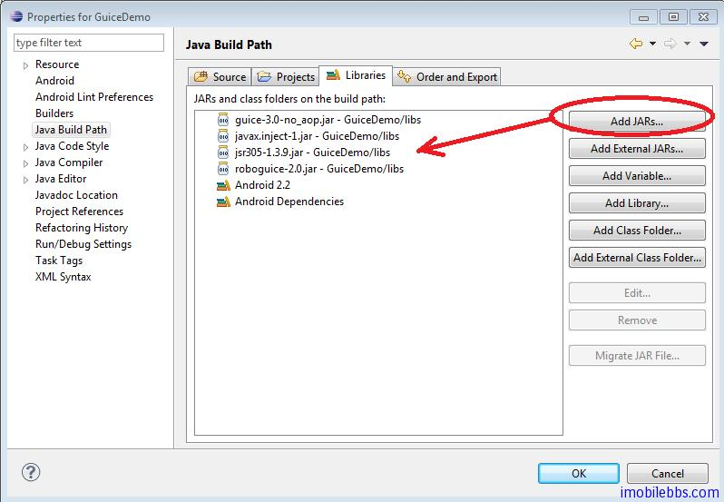
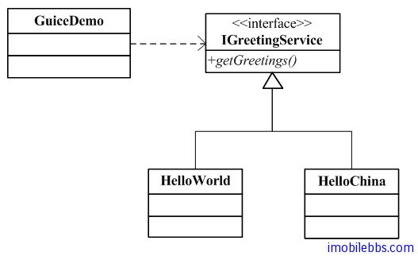
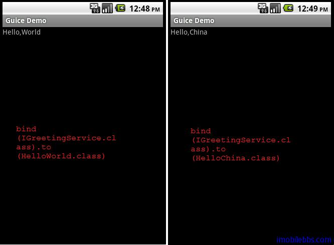

#第一个例子 Hello World

本例实现的功能和例子 [Android RoboGuice 使用指南(2):第一个例子Hello World](http://www.imobilebbs.com/wordpress/?p=2486) 一样，所不同的是本例使用 RoboGuice2.0 来实现。

1. 下载新的 RoboGuice 库，Roboguice2.0 库有四个库组成，如下图所示：



库可以从 [http://code.google.com/p/roboguice/](http://code.google.com/p/roboguice/) 下载，也可以从本站 [下载](http://www.imobilebbs.com/download/android/roboguice/roboguice2libs.zip)

2. 创建一个新 Android 项目，比如 GuiceDemo，目标平台 Android1.5 以上。

3. 一般可以在该项目下添加一个 libs 目录，将两个 jar 文件拷到 libs 目录下，然后通过: Project > Properties > Java Build Path > Libraries > Add  JARs



注：从 ADT17 开始，添加的 jar 文件需放在 libs 子目录下，可以参见升级到 [ADT 17 出现 dalvikvm： Unable to resolve superclass 的问题](http://www.imobilebbs.com/wordpress/?p=2947)

添加了对应 guice 和 roboguice 库的引用之后，就可以开始编写第一个使用 roboguice2 的例子。

使用 roboguice2 的步骤：

Roboguice2 中不在含有 RoboApplication 类，因此无需也不可能派生 RoboApplication 的子类。这里重复一下 HelloWorld 的 Layout 和类说明

1. 在这个简单的例子中，它使用的 Layout 定义如下：

```
<?xml version=”1.0″ encoding=”utf-8″?>
<LinearLayout xmlns:android=”http://schemas.android.com/apk/res/android”
android:orientation=”vertical”
android:layout_width=”fill_parent”
android:layout_height=”fill_parent”
>
<TextView
android:id=”@+id/hello”
android:layout_width=”fill_parent”
android:layout_height=”wrap_content”
android:text=”@string/hello”
/>
</LinearLayout>

```

我们定义了一个 TextView ，它的 id 为 hello.

假定这个应用使用一个 IGreetingService ,它有一个方法 getGreeting() 返回一个字符串，至于 IGreetingService 如何实现，GuideDemo 不需要关心。



Dependency injection 设计模式的一个核心原则为: Separate behavior from dependency resolution. 也就说将应用需要实现的功能和其所依赖的服务或其它对象分离。 对本例来说 GuiceDemo 只要知道它依赖于 IGreetingService 服务，至于 IGreetingService 有谁实现GuiceDemo 并不需要知道。

在 Roboguice 中使用 @Inject 来表示这种依赖关系。

```
public class GuiceDemo extends RoboActivity  {

 @InjectView (R.id.hello) TextView helloLabel;
 @Inject IGreetingService greetingServce;

 @Override
 public void onCreate(Bundle savedInstanceState) {
 super.onCreate(savedInstanceState);
 setContentView(R.layout.main);
 helloLabel.setText(greetingServce.getGreetings());
 }
}

```

- 使用 RoboGuice 的 Activity 需要从 RoboActivity 派生 (RoboActivity 为 Activity 的子类).
- 使用 @Inject 标注 greetingServce 依赖于 IGreetingService 服务
- 使用 @InjectView 表示 helloLabel 依赖于 R.id.hello （XML）

代码中没有创建 greetingServce 对象的代码（如 new xxx()) 和为 helloLabel 赋值的代码。这些值都可以 Roboguice 自动创建和赋值注入（Inject) 到变量中。

为了说明问题，我们在代码中添加两个对 getGreetings 的实现，一个为HelloWorld, 一个为 HelloChina:

```
public class HelloChina implements IGreetingService{

 @Override
 public String getGreetings() {
 return "Hello,China";
 }

}

public class HelloWorld implements IGreetingService{

 @Override
 public String getGreetings() {
 return "Hello,World";
 }

}

```

2. 到这里，你可能有些困惑，RoboGuice 怎么知道使用那个类（HelloWorld 或是 HelloChina）为 GuiceDemo 中的 greetingServce 赋值呢？这是通过在 Module 中定义 binding 来实现的。

在项目中添加一个 GreetingModule （从 AbstractModule 派生而非 AbstractAndroidModule 类）重载 configure 方法：

```
public class GreetingModule extends AbstractAndroidModule{

@Override
protected void configure() {
bind(IGreetingService.class).to(HelloWorld.class);
//bind(IGreetingService.class).to(HelloChina.class);

}

}

```

将 IGreetingService 绑定到 HelloWorld 类。

3. 在 res/values/roboguice.xml 定义 Module

```
<?xml version="1.0" encoding="utf-8"?>
<resources>
    <string-array name="roboguice_modules">
        <item>com.pstreets.guice.demo.GreetingModule</item>
    </string-array>
</resources>

```

可以将 GreetingModule 绑定改为 HelloChina ，对比一下：
 


通过改变 binding ，GuiceDemo 显示了不同的结果，GuiceDemo 不依赖于具体的实现，可以非常方便的改变接口的实现而无需更改 GuiceDemo 的代码。大大降低了类于类之间的耦合性。
