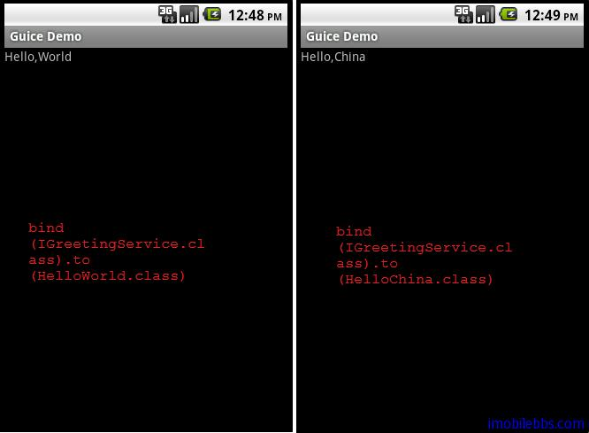

#第一個例子 Hello World
##首先介紹一下如果將 Guice 和 RoboGuice 的庫添加到項目中。

1. 下載 RoboGuice 和 guice-2.0-no_aop.jar(not guice-3.0), 或者下載 
2. 創建一個新 Android 項目，比如 GuiceDemo，目標平台 Android1.5 以上。
3. 一般可以在該項目下添加一個 lib 目錄，將兩個 jar 文件拷到 lib目錄下，然後通過: Project > Properties > Java Build Path > Libraries > Add External JARs


添加了對應 guice 和 roboguice 庫的引用之後，就可以開始編寫第一個使用 roboguice 的例子。

##使用roboguice 的步驟：

1. 創建一個 RoboApplication 的子類 GuiceApplication，GuiceApplication 為 Appliacation 的子類，因此需要修改 AndroidManifest.xml,將 Application 的 name 指向這個類。可以參見 [Android 簡明開發教程九：創建應用程序框架](http://www.imobilebbs.com/wordpress/?p=896)

```

<application android:name=”GuiceApplication”
android:icon=”@drawable/icon” android:label=”@string/app_name”>
<activity android:name=”.GuiceDemo”
android:label=”@string/app_name”>
<intent-filter>
<action android:name=”android.intent.action.MAIN” />
<category android:name=”android.intent.category.LAUNCHER” />
</intent-filter>
</activity>

</application>
```

2.  在這個簡單的例子中，它使用的 Layout 定義如下：

```

<?xml version=”1.0″ encoding=”utf-8″?>
<LinearLayout xmlns:android=”http://schemas.android.com/apk/res/android”
android:orientation=”vertical”
android:layout_width=”fill_parent”
android:layout_height=”fill_parent”
>
<TextView
android:id=”@+id/hello”
android:layout_width=”fill_parent”
android:layout_height=”wrap_content”
android:text=”@string/hello”
/>
</LinearLayout>

```
我們定義了一個 TextView ，它的 id 為 hello.

假定這個應用使用一個 IGreetingService ,它有一個方法 getGreeting() 返回一個字元串，至於 IGreetingService 如何實現，GuideDemo 不需要關心。


Dependency injection 設計模式的一個核心原則為: Separate behavior from dependency resolution. 也就說將應用需要實現的功能和其所依賴的服務或其它對象分離。 對本例來說 GuiceDemo 只要知道它依賴於 IGreetingService 服務，至於 IGreetingService 有誰實現GuiceDemo 並不需要知道。

在 Roboguice 中使用 @Inject 來表示這種依賴關係。

```

public class GuiceDemo extends RoboActivity  {

 @InjectView (R.id.hello) TextView helloLabel;
 @Inject IGreetingService greetingServce;

 @Override
 public void onCreate(Bundle savedInstanceState) {
 super.onCreate(savedInstanceState);
 setContentView(R.layout.main);
 helloLabel.setText(greetingServce.getGreetings());
 }
}

```

+ 使用 RoboGuice 的 Activity 需要從 RoboActivity 派生 (RoboActivity 為 Activity 的子類).
+ 使用 @Inject 標註 greetingServce 依賴於 IGreetingService 服務
+ 使用 @InjectView 表示 helloLabel 依賴於 R.id.hello （XML）

代碼中沒有創建 greetingServce 對象的代碼（如 new xxx()) 和為 helloLabel 賦值的代碼。這些值都可以 Roboguice 自動創建和賦值注入（Inject) 到變數中。

為了說明問題，我們在代碼中添加兩個對 getGreetings 的實現，一個為 HelloWorld, 一個為 HelloChina:

```

public class HelloChina implements IGreetingService{

 @Override
 public String getGreetings() {
 return "Hello,China";
 }

}

public class HelloWorld implements IGreetingService{

 @Override
 public String getGreetings() {
 return "Hello,World";
 }

}

```

3. 到這裡，你可能有些困惑，RoboGuice 怎麼知道使用那個類（HelloWorld 或是 HelloChina）為 GuiceDemo 中的 greetingServce 賦值呢？這是通過在 Module 中定義 binding 來實現的。
 
項目中添加一個 GreetingModule （從 AbstractAndroidModule 派生）重載 configure 方法：

```

public class GreetingModule extends AbstractAndroidModule{

@Override
protected void configure() {
bind(IGreetingService.class).to(HelloWorld.class);
//bind(IGreetingService.class).to(HelloChina.class);

}

}

```

將 IGreetingService 綁定到 HelloWorld 類。

然後在 GuiceApplication 的 addApplicationModules 添加上述模塊：

```

public class GuiceApplication extends RoboApplication {

 protected void addApplicationModules(List<Module> modules) {
 modules.add(new GreetingModule());
 }

}

```

可以將 GreetingModule 綁定改為 HelloChina ，對比一下：



通過改變 binding ，GuiceDemo 顯示了不同的結果，GuiceDemo 不依賴於具體的實現，可以非常方便的改變介面的實現而無需更改 GuiceDemo的代碼。大大降低了類於類之間的耦合性。

後面將逐個介紹 Guice 和 RoboGuice 支持的 Binding 類型和用法(Guice) 以及與 android 平台相關的 Dependency injection (RoboGuice)


