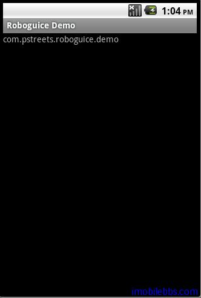

#Inject Context

在 Android 应用程序中，很多地方需要引用到 Context 对象（Activity，Application，Service 等）。Roboguice 使得引用Context 对象变得非常容易。

可以参见下面例子，这里定义一个不在 Activity 中的类 ContextInfo，需要引用 Context 对象：

```
class ContextInfo{

 final Context context;
 @Inject
 ContextInfo(Context context){
 this.context=context;
 }

 String getPackageName(){
 return context.getApplicationInfo().packageName;
 }
}

```

需要应用 Context 对象时，使用 @Inject 标记，Roboguice 会自动注入所需 Context 对象。

定义一个 InjectContextDemo，使用一个 TextView 来显示ContextInfo 的 getPackageName 内容。

```
public class InjectContextDemo extends RoboActivity {

 @InjectView (R.id.textview) TextView textView;
 @Inject ContextInfo contextInfo;

 @Override
 public void onCreate(Bundle savedInstanceState) {
 super.onCreate(savedInstanceState);

 setContentView(R.layout.injectcontext);
 textView.setText(contextInfo.getPackageName());

 }

}

```

在 InjectContextDemo 中定义一个 InjectContextDemo，也使用@Inject 通知 Roboguice 自动创建它的一个实例。Roboguice 在创建这个对象时，调用其 Injectable 构造函数（参见 [Android RoboGuice 使用指南(10)： Just-in-time Bindings](http://www.imobilebbs.com/wordpress/archives/2558?p=2537) ),自动传入 Context 对象。



如果需要应用 Application 对象，可以将构造函数改为

```
@Inject
 ContextInfo(RoboguiceDemoApplication context){
 this.context=context;
}
或引用Activity

@Inject 
 ContextInfo(Activity context){
  this.context=context;	
}

```

