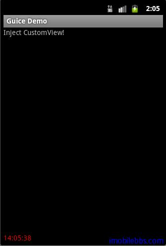

#Inject 自定义 View

前面介绍了 Android RoboGuice2 的 [HelloWorld 示例](http://www.imobilebbs.com/wordpress/?p=3111)，并介绍了从 RoboGuice 1.1 升级到 RoboGuice2.0 的主要 [注意事项](http://www.imobilebbs.com/wordpress/?p=3100)。其它的基本概念和 RoboGuice1.1 基本一样，可以参见

- Android RoboGuice 使用指南(3):Bindings 概述
- Android RoboGuice 使用指南(4):Linked Bindings
- Android RoboGuice 使用指南(5):Binding Annotations
- Android RoboGuice 使用指南(6):Instance Bindings
- Android RoboGuice 使用指南(7):@Provides Methods
- Android RoboGuice 使用指南(8):Provider Bindings
- Android RoboGuice 使用指南(9):Untargetted Bindings
- Android RoboGuice 使用指南(10)：Just-in-time Bindings
- Android RoboGuice 使用指南(11)：Scopes
- Android RoboGuice 使用指南(12)：如何绑定 generic 类型
- Android RoboGuice 使用指南(13):RoboGuice 功能描述
- Android RoboGuice 使用指南(14):Inject View
- Android RoboGuice 使用指南(15):Inject Context
- Android RoboGuice 使用指南(16):Standard Injection
- Android RoboGuice 使用指南(17):Inject Extra
- Android RoboGuice 使用指南(18):Inject Resources
- Android RoboGuice 使用指南(19):发送接收 Events

本例介绍如何 Inject 自定义的 View，Inject 自定义的 View 和 Android 自带的 View（如 TextView，Button）方法一样。

本例使用一个自定义的 TextView，每隔1秒显示当前时间。前定义如下：

```
//--------------------------------- PACKAGE ------------------------------------
package com.pstreets.guice.customview;

//--------------------------------- IMPORTS ------------------------------------
import android.content.Context;
import android.os.Handler;
import android.util.AttributeSet;
import android.widget.TextView;

import java.util.Calendar;
import java.util.Date;

public final class TimeTextView extends TextView {

	public TimeTextView(Context context, AttributeSet attrs) {
		super(context, attrs);
		postDelayed(mUpdateView, mRepeatTimePeriod);

	}

	private void setTimeString() {
		Calendar c = Calendar.getInstance();
		Date currentTime = c.getTime();
		String timeString = formatTime(currentTime);
		setText(timeString);
	}

	private Handler mHandler = new Handler();
	/**
	 * one second.
	 */
	private int mRepeatTimePeriod = 1000;

	private Runnable mUpdateView = new Runnable() {

		@Override
		public void run() {
			TimeTextView.this.setTimeString();
			// Force toggle again in a second
			mHandler.postDelayed(this, mRepeatTimePeriod);
		}

	};

	private String formatTime(Date time) {
		int hours = time.getHours();
		int miniutes = time.getMinutes();
		int seconds = time.getSeconds();
		String ret = "";
		if (hours < 10) {
			ret += "0";
		}
		ret += hours + ":";
		if (miniutes < 10) {
			ret += "0";
		}
		ret += miniutes + ":";
		if (seconds < 10) {
			ret += "0";
		}
		ret += seconds;

		return ret;
	}

}

```

修改 main.xml

```
<?xml version="1.0" encoding="utf-8"?>
<LinearLayout xmlns:android="http://schemas.android.com/apk/res/android"
    android:orientation="vertical"
    android:layout_width="fill_parent"
    android:layout_height="fill_parent"
    >
<TextView
    android:id="@+id/hello"
    android:layout_width="fill_parent"
    android:layout_height="wrap_content"
    android:text="@string/hello"
    />
<TextView

    android:layout_width="fill_parent"
    android:layout_height="0dp"
    android:layout_weight="1.0"

    />
<com.pstreets.guice.customview.TimeTextView
    android:id="@+id/txtTime"
    android:layout_width="fill_parent"
    android:layout_height="wrap_content"

    />
</LinearLayout>

```

定义该 TimeTextView 的 id 为 txtTime。

这样可以在对应的 Activity 中使用 InjectView 来给对应的 txtTime 自动赋值（注入）。

```
@ContentView(R.layout.main)
public class GuiceDemo extends RoboActivity  {

	@InjectView (R.id.txtTime) TimeTextView txtTime;

    @Override
    public void onCreate(Bundle savedInstanceState) {
        super.onCreate(savedInstanceState);
        txtTime.setTextColor(0xFFFF0000);

    }

}

```

由于 GuiceDemo 是从 RoboActivity 派生的，在 onCreate 第一行的 super.onCreate() 完成注入功能。如果你对 RoboGuice1.1 熟悉的话，在使用注入的变量前如 txtTime,需要执行 setContentView。
在 RoboGuice2.0 中你可以使用同样的方法，2.0还提供了一个简单的标注方法 @ContentView ，如本例，为 Activity 设置 ContentView。



[本例下载](http://www.imobilebbs.com/download/android/RoboGuiceDemo1.zip) 。

从本例可以看出，和 RoboGuice1.1 相比，RoboGuice2.0 在使用上要简洁的多。本例只需从 RoboActivity 派生，不在需要定义 Application 等。

