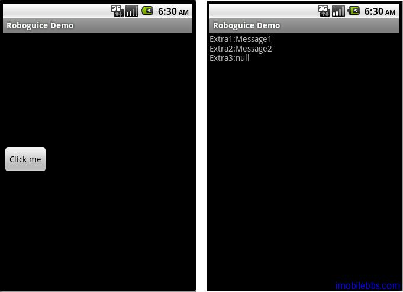

#Inject Extra

使用 Intent 启动一个 Activity，Service 等时，可以通过 putExtra 传送数据，被触发的 Activity，Service 可以使用 getIntent() 的 getExtras 取的 Extra 的 Bundle ，然后再根据 Extra 的键值 (Key) 取的对应的参数值。

RoboGuice 提供了一个简洁的方法来取得 这些 Extra 值，通过 @InjectExtra 标记。

本例使用两个 Activity，InjectExtraDemo 用来触发InjectExtraReceiver，在 InjectExtraDemo 中创建 Intent 时，通过 putExtra 放置两个参数 Extra1,Extra2.

```
public class InjectExtraDemo extends RoboActivity {

 @InjectView (R.id.button) Button button;
 @Inject Context context;


 @Override
 public void onCreate(Bundle savedInstanceState) {
 super.onCreate(savedInstanceState);
 setContentView(R.layout.injectextra);
 button.setOnClickListener(mGoListener);
 }

 private OnClickListener mGoListener = new OnClickListener()
 {
 public void onClick(View v)
 {
 Intent di = new Intent();
 di.setClass(context, InjectExtraReceiver.class) ;
 di.addFlags(Intent.FLAG_ACTIVITY_NEW_TASK
 | Intent.FLAG_ACTIVITY_SINGLE_TOP);
 di.putExtra("Extra1","Message1");
 di.putExtra("Extra2","Message2");
 context.startActivity(di);
 }
 };

}

```

在 InjectExtraReceiver 通过 @InjectExtra 标记 ，Roboguice 自动为这些变量注入由 Intent 传入的值，Optional=true 表示该 Extra 为可选，如果传入的 Intent 不含这个 Extra 时，值为 null.

```
public class InjectExtraReceiver extends RoboActivity{

 @InjectView (R.id.textview) TextView textView;
 @InjectExtra ("Extra1" ) String extra1;
 @InjectExtra ("Extra2" ) String extra2;
 @InjectExtra (value="Extra3" , optional=true) String extra3;

 @Override
 public void onCreate(Bundle savedInstanceState) {
 super.onCreate(savedInstanceState);

 setContentView(R.layout.injectextrareceiver);

 textView.setText("Extra1:"+extra1
 +"\r\nExtra2:"+extra2
 +"\r\nExtra3:"+extra3);

 }

}

```



