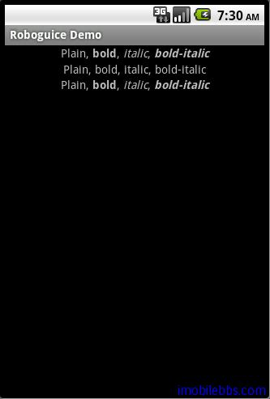

#Inject Resources

Roboguice 對訪問 res 目錄下各種資源 drawable, arrary, string 等也提供了注入支持。可以通過 @InjectResource 很方便的應用所需資源。

本例修改 [Android ApiDemos 示例解析(48)：Content->Resources->Resources](http://www.imobilebbs.com/wordpress/?p=1353) 使用 Inject Resource 方法來訪問資源。

```
public class InjectResourceDemo extends RoboActivity {

 @InjectView (R.id.styled_text) TextView styled_text;
 @InjectView (R.id.plain_text) TextView plain_text;
 @InjectView (R.id.res1) TextView res1;
 @Inject Resources res;
 @InjectResource(R.string.styled_text) String str;


 @Override
 public void onCreate(Bundle savedInstanceState) {
 super.onCreate(savedInstanceState);
 setContentView(R.layout.injectresource);

 //Use res to get the string resources
 CharSequence cs=res.getText(R.string.styled_text);
 // Note the use of
 // CharSequence instead of String
 // so we don't lose the style info.
 styled_text.setText(cs);

 // Use the same resource, but convert it to
 // a string, which causes it
 // to lose the style information.
 plain_text.setText(str);
 res1.setText(cs);

 }

}

```



