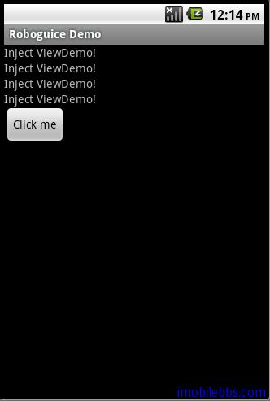

#Inject View

在例子 [Android RoboGuice 使用指南(2):第一个例子 Hello World](http://www.imobilebbs.com/wordpress/?p=2486) 介绍了使用 Roboguice 开发的基本步骤：

1. 创建一个 RoboApplication 的子类 GuiceApplication，GuiceApplication 为 Appliacation 的子类，修改AndroidManifest.xml,将 Application 的 name 指向这个类。
2. 将原先由 Activity 派生的类基类改为 RoboActivity（或其它相关Activity).
3. 如果有需要的话在 AbstractAndroidModule 中重载configuatation 方法定义 bindings.

如果不使用 Roboguice，如果 Activity 中需要访问定义在 Layout 中的某个 View，一般需要使用 findViewById 来查找对应的 View，并将它强制转换为对应的类，如果需要访问的 View 很多，重复的代码就非常繁琐。

如果使用 Roboguice 的 Inject View ，代码就简洁易读多了，@Inject View 的基本用法如下：

@InjectView (R.id.xxx)  ViewType  viewInstance;

+ R.id.xxx 为所需 View 定义在 Layout 中的 id  ,如R.id.textview1
+ ViewType 为所需 View 的类型，如 TextView
+ viewInstance 为变量名。

我们定义一个 injectview.xml ，如下：

```

<?xml version=”1.0″ encoding=”utf-8″?>
<LinearLayout
xmlns:android=”http://schemas.android.com/apk/res/android”
android:orientation=”vertical”
android:layout_width=”match_parent”
android:layout_height=”match_parent”>

<TextView 
android:id=”@+id/textview1″
android:layout_width=”fill_parent”
android:layout_height=”wrap_content”
android:text=”@string/injectview”
/>

<TextView 
android:id=”@+id/textview2″
android:layout_width=”fill_parent”
android:layout_height=”wrap_content”
android:text=”@string/injectview”
/>

<TextView 
android:id=”@+id/textview3″
android:layout_width=”fill_parent”
android:layout_height=”wrap_content”
android:text=”@string/injectview”
/>

<TextView 
android:id=”@+id/textview4″
android:layout_width=”fill_parent”
android:layout_height=”wrap_content”
android:text=”@string/injectview”
/>

<Button android:id=”@+id/button”
android:layout_width=”wrap_content”
android:layout_height=”wrap_content”
android:layout_gravity=”center_vertical”
android:text=”@string/clickmebutton”/>

</LinearLayout>

```

定义了4个 TextView 和一个 Button，看看如何使用 InjectView 来访问这些 View：

```
public class InjectViewDemo extends RoboActivity {

 @InjectView (R.id.button) Button goButton;
 @InjectView (R.id.textview1) TextView textView1;
 @InjectView (R.id.textview2) TextView textView2;
 @InjectView (R.id.textview3) TextView textView3;
 @InjectView (R.id.textview4) TextView textView4;

 @Override
 public void onCreate(Bundle savedInstanceState) {
 super.onCreate(savedInstanceState);

 setContentView(R.layout.injectview);
 goButton.setOnClickListener(mGoListener);
 }

 private OnClickListener mGoListener = new OnClickListener()
 {
 public void onClick(View v)
 {
 textView1.setText("Clicked");
 textView2.setText("Clicked");
 textView3.setText("Clicked");
 textView4.setText("Clicked");
 }
 };
}

```

无需使用 findViewById 来为每个变量（如 textview1)赋值，只需使用@InjectView 标记，赋值的工作都由 Roboguice 来完成，程序只需向Roboguice 说“给我某个 View”，Roboguice 就通过 Dependency Injection 传给应用程序所需 View 的实例对象。代码比不使用Roboguice 时简洁多了。



