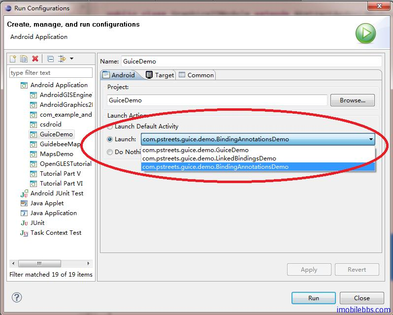

#Instance Bindings
我们在前面例子 [Android RoboGuice 使用指南(4):Linked Bindings ](http://www.imobilebbs.com/wordpress/archives/2517?p=2503) 时为简单起见，定义MyRectangle和MySquare时为它们定义了一个不带参数的构造函数，如MyRectangle的如下：

```
public class MyRectangle extends Rectangle{
 public MyRectangle(){
 super(50,50,100,120);
 }
 public MyRectangle(int width, int height){
 super(50,50,width,height);
 }
}
```

实际上可以不需要这个不带参数的构造函数，可以使用 Instance Bindings ，Instance Bindings 可以将一个类型绑定到一个特定的实例对象，通常用于一个本身不依赖其它类的类型，如各种基本类型，比如：

```
bind(String.class)
 .annotatedWith(Names.named("JDBC URL"))
 .toInstance("jdbc:mysql://localhost/pizza");
bind(Integer.class)
 .annotatedWith(Names.named("login timeout seconds"))
 .toInstance(10);
修改MyRectangle和MySquare的定义如下：

public class MySquare extends MyRectangle {
 @Inject
 public MySquare(@Named("width") int width){
 super(width,width);
 }
}
...
public class MyRectangle extends Rectangle{

 @Inject
 public MyRectangle(@Named("width") int width,
 @Named("height")int height){
 super(50,50,width,height);
 }
}
```

去掉了无参数的构造函数，可以将标注为 @Named(“width”) 的 int 类型绑定到100，添加下面绑定：

```
bind(Integer.class)
 .annotatedWith(Names.named("width"))
 .toInstance(100);
bind(Integer.class)
 .annotatedWith(Names.named("height"))
 .toInstance(120);
```

运行这个例子，可以得到和前面例子同样的结果。此时使用 Injector 构造一个 MyRectangle 实例时，Injector 自动选用带参数的那个构造函数，使用100，120为 width 和 height 注入参数，返回一个MyRectangle 对象到需要引用的地方。

尽管可以使用 Instance Bindings 将一个类型映射到一个复杂类型的类实例，但 RoboGuice 不建议将 Instance Bindings 应用到复杂类型的实例，因为这样会使应用程序启动变慢。

正确的方法是使用 @Provides 方法，将在下面介绍。

注：GuiceDemo 中的例子没用使用列表的方法来显示所有示例，如需运行所需示例，可以通过 Run Configuration-> 设置 Launch 的Activity：



