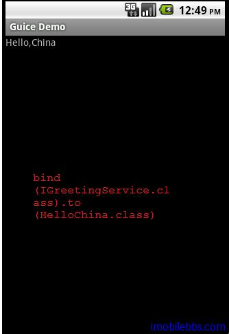
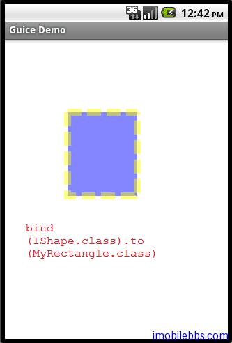
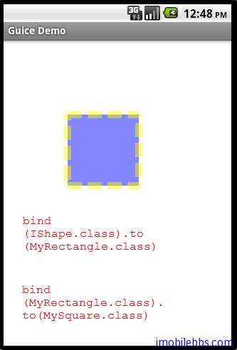

#Linked Bindings
Roboguice 中最常用的一种绑定为 Linked Bindings，将某个类型映射到其实现。这里我们使用引路蜂二维图形库中的类为例，引路蜂二维图形库的使用可以参见 [Android简明开发教程八：引路蜂二维图形绘制实例功能定义](http://www.imobilebbs.com/wordpress/archives/886)

使用下面几个类 IShape, Rectangle, MyRectangle, MySquare, 其继承关系如下图所示：



下面代码将 IShape 映射到 MyRectangle

```

public class Graphics2DModule extends AbstractAndroidModule{

 @Override
 protected void configure() {

 bind(IShape.class).to(MyRectangle.class);

 }
}

```

此时，如果使用 injector.getInstance(IShape.class) 或是injector 碰到依赖于 IShape 地方时,它将使用 MyRectangle。可以将类型映射到它任意子类或是实现了该类型接口的所有类。也可以将一个实类（非接口）映射到其子类，如

bind(MyRectangle.class).to(MySquare.class);

下面例子使用 @Inject 应用 IShape.

```

public class LinkedBindingsDemo extends Graphics2DActivity{

@Inject IShape  shape;

protected void drawImage(){

/**
* The semi-opaque blue color in
* the ARGB space (alpha is 0x78)
*/
Color blueColor = new Color(0x780000ff,true);
/**
* The semi-opaque yellow color in the
* ARGB space ( alpha is 0x78)
*/
Color yellowColor = new Color(0x78ffff00,true);

/**
* The dash array
*/
int dashArray[] = { 20 ,8 };
graphics2D.clear(Color.WHITE);
graphics2D.Reset();
Pen pen=new Pen(yellowColor,10,Pen.CAP_BUTT,
Pen.JOIN_MITER,dashArray,0);
SolidBrush brush=new SolidBrush(blueColor);
graphics2D.setPenAndBrush(pen,brush);
graphics2D.fill(null,shape);
graphics2D.draw(null,shape);

}

}

```

使用 bind(IShape.class).to(MyRectangle.class)，为了简化问题，这里定义了 MyRectangle 和 MySquare 都带有一个不带参数的构造函数，注入具有带参数的构造函数类用法在后面有介绍。

```

public class MyRectangle extends Rectangle{
 public MyRectangle(){
 super(50,50,100,120);
 }

 public MyRectangle(int width, int height){
 super(50,50,width,height);
 }
}
...
public class MySquare extends MyRectangle {

 public MySquare(){
 super(100,100);
 }

 public MySquare(int width){
 super(width,width);
 }

}

```



Linked bindings 允许链接，例如

```

public class Graphics2DModule extends AbstractAndroidModule{

 @Override
 protected void configure() {
 bind(IShape.class).to(MyRectangle.class);
 bind(MyRectangle.class).to(MySquare.class);

 }
}
```

此时当需要 IShape 时，Injector 返回 MySquare 的实例, IShape->MyRectangle->MySquare




