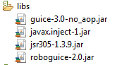

#概述

RoboGuice 最近推出了2.0版本。和1.1相比具有：

- 提高了稳定性
- 支持 Fragment
- 更简洁易用

但由于 RoboGuice2 不完全向下兼容 RoboGuice1.1，因此原来使用 RobuGuice1.1 开发的项目需要对代码做些修改才可以使用 RoboGuice2.0.

这里主要说明一下使用 Eclipse IDE 开发环境升级到 RoboGuice2.0 的一些升级注意事项：

1. 下载新的 RoboGuice 库，Roboguice2.0 库有四个库组成，如下图所示：



库可以从 [http://code.google.com/p/roboguice/](http://code.google.com/p/roboguice/) 下载，也可以从本站 [下载](http://www.imobilebbs.com/download/android/roboguice/roboguice2libs.zip)

2. 原先1.1中的 RoboApplication 在2.0 已经不存在了。2.0使用上更方便，通常的应用如果不是有自定义绑定的话，无需再派生 Application。

3. 如果你使用了自定义的 Module 来定义 Bindings，在2.0中可以通过 XML 来定义，比如在 res/values/roboguice.xml 定义

```
<?xml version=”1.0″ encoding=”utf-8″?>

<resources>

<string-array name=”roboguice_modules”>

<item>com.pstreets.guice.demo.GreetingModule</item>

</string-array> </resources>

```

4. 原先由 AbstractAndroidModule 派生的类，在2.0中改为 AbstractModule ，如：

```
ublic class GreetingModule extends AbstractModule {

@Override  protected void configure() {   bind(IGreetingService.class).to(HelloWorld.class);   //bind(IGreetingService.class).to(HelloChina.class);     }

}
```

5. 修改 AndroidManifest.xml ，去除原来定义的 RoboApplication 派生类定义，并在代码中去除 RoboApplication 派生类定义。

以上是主要从 RoboGuice1.1 升级到2.0的主要步骤。在学习2.0之前，可以参考一下1.1的介绍，基本概念还是一样的。

- [Android RoboGuice 使用指南(1):概述](http://www.imobilebbs.com/wordpress/?p=2480)
- [Android RoboGuice 使用指南(2):第一个例子 Hello World](http://www.imobilebbs.com/wordpress/?p=2486)
- [Android RoboGuice 使用指南(3):Bindings 概述](http://www.imobilebbs.com/wordpress/?p=2497)
- [Android RoboGuice 使用指南(4):Linked Bindings](http://www.imobilebbs.com/wordpress/?p=2503)
- [Android RoboGuice 使用指南(5):Binding Annotations](http://www.imobilebbs.com/wordpress/?p=2510)
- [Android RoboGuice 使用指南(6):Instance Bindings](http://www.imobilebbs.com/wordpress/?p=2517)
- [Android RoboGuice 使用指南(7):@Provides Methods](http://www.imobilebbs.com/wordpress/?p=2523)
- [Android RoboGuice 使用指南(8):Provider Bindings](http://www.imobilebbs.com/wordpress/?p=2528)
- [Android RoboGuice 使用指南(9):Untargetted Bindings](http://www.imobilebbs.com/wordpress/?p=2534)
- [Android RoboGuice 使用指南(10)：Just-in-time Bindings](http://www.imobilebbs.com/wordpress/?p=2537)
- [Android RoboGuice 使用指南(11)：Scopes](http://www.imobilebbs.com/wordpress/?p=2540)
- [Android RoboGuice 使用指南(12)：如何绑定 generic 类型](http://www.imobilebbs.com/wordpress/?p=2543)
- [Android RoboGuice 使用指南(13):RoboGuice 功能描述](http://www.imobilebbs.com/wordpress/?p=2545)
- [Android RoboGuice 使用指南(14):Inject View](http://www.imobilebbs.com/wordpress/?p=2549)
- [Android RoboGuice 使用指南(15):Inject Context](http://www.imobilebbs.com/wordpress/?p=2558)
- [Android RoboGuice 使用指南(16):Standard Injection](http://www.imobilebbs.com/wordpress/?p=2563)
- [Android RoboGuice 使用指南(17):Inject Extra](http://www.imobilebbs.com/wordpress/?p=2569)
- [Android RoboGuice 使用指南(18):Inject Resources](http://www.imobilebbs.com/wordpress/?p=2573)
- [Android RoboGuice 使用指南(19):发送接收 Events](http://www.imobilebbs.com/wordpress/?p=2577)
 