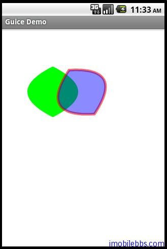

#Provider Bindings

如果 @Provides 方法很复杂的话，可以将这些代码移动到单独的类中。这个类需要实现 Guice 的 Provider 接口，该接口定义如下：

```
public interface Provider<T> {
 T get();
}

```

为一个 generic 接口。

本例我们定义一个 PathProvider，用于返回一个 Path 对象：

```
public class PathProvider implements Provider<Path>{

 private String pathdata
 = "M 60 20 Q -40 70 60 120 Q 160 70 60 20 z";
 @Override
 public Path get() {
 return Path.fromString(pathdata);
 }

}

```

然后在 Module 中定义从 Path 类到 Provider 的绑定：

```
bind(Path.class).toProvider(PathProvider.class);

```

然后使用绘制这个 Path：

```
public class ProviderBindingsDemo extends Graphics2DActivity{

 @Inject Path path;

 protected void drawImage(){

 AffineTransform mat1;

 // Colors
 Color redColor = new Color(0x96ff0000, true);
 Color greenColor = new Color(0xff00ff00);
 Color blueColor = new Color(0x750000ff, true);

 mat1 = new AffineTransform();
 mat1.translate(30, 40);
 mat1.rotate(-30 * Math.PI / 180.0);

 // Clear the canvas with white color.
 graphics2D.clear(Color.WHITE);

 graphics2D.setAffineTransform(new AffineTransform());
 SolidBrush brush = new SolidBrush(greenColor);
 graphics2D.fill(brush, path);
 graphics2D.setAffineTransform(mat1);

 brush = new SolidBrush(blueColor);
 com.mapdigit.drawing.Pen pen
 = new com.mapdigit.drawing.Pen(redColor, 5);
 graphics2D.setPenAndBrush(pen, brush);
 graphics2D.draw(null, path);
 graphics2D.fill(null, path);

 }

}

```



