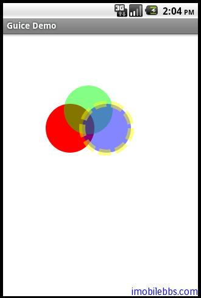

#@Provides Methods
上例说过如果需要构造一些较复杂的类的实例，通常的方法是使用 @Provides 方法。这个方法必须定义在模块中 (Module)，而且必须使用 @Provides 标注，在个方法的返回类型则绑定到这个方法返回的对象实例。

如果这个方法带有 [binding Annotation](http://www.imobilebbs.com/wordpress/?p=2510) 或是 @Named(“xxx”)，Guice 则将 @Provides 方法返回的对象绑定到这个 annotated 类型。

例使用 @Provides 创建三个圆，然后再屏幕上显示出来，图形库的使用可以参见 [Android简明开发教程十二：引路蜂二维图形库简介及颜色示例 ](http://www.imobilebbs.com/wordpress/?p=930). 其实创建圆并不复杂，这里只是用来说明 @Provides 方法的用法。

在 Graphics2DModule 在添加三个 @Provides 方法：

```
@Provides @Named("Circle1")
IShape provideCircle1(){
 return new Ellipse(30,60,80,80);
}

@Provides @Named("Circle2")
IShape provideCircle2(){
 return new Ellipse(60,30,80,80);
}

@Provides @Named("Circle3")
IShape provideCircle3(){
 return new Ellipse(90,60,80,80);
}

```

分别绑定到 IShape 带有标注 @Named(“Circle1″)，@Named(“Circle2″)，@Named(“Circle3″).

创建 ProvidesMethodsDemo，有如下代码

```
public class ProvidesMethodsDemo extends Graphics2DActivity{

 @Inject @Named("Circle1") IShape circle1;
 @Inject @Named("Circle2") IShape circle2;
 @Inject @Named("Circle3") IShape circle3;

 protected void drawImage(){

 // The solid (full opaque) red color in the ARGB space
 Color redColor    = new Color(0xffff0000);

 // The semi-opaque green color in the ARGB space (alpha is 0x78)
 Color greenColor = new Color(0x7800ff00,true);

// The semi-opaque blue color in the ARGB space (alpha is 0x78)
 Color blueColor = new Color(0x780000ff,true);

// The semi-opaque yellow color in the ARGB space ( alpha is 0x78)
 Color yellowColor = new Color(0x78ffff00,true);

// The dash array
 int dashArray[] = { 20 ,8 };
 graphics2D.clear(Color.WHITE);
 graphics2D.Reset();
 SolidBrush brush=new SolidBrush(redColor);
 graphics2D.fill(brush,circle1);
 brush=new SolidBrush(greenColor);
 graphics2D.fill(brush,circle2);
 Pen pen=new Pen(yellowColor,10,Pen.CAP_BUTT,Pen.JOIN_MITER,dashArray,0);
 brush=new SolidBrush(blueColor);
 graphics2D.setPenAndBrush(pen,brush);
 graphics2D.fill(null,circle3);
 graphics2D.draw(null,circle3);

 }

}
```

@Provides 方法通常用来创建将复杂的类对象，可以带参数，参数也可以通过注入传入比如：

```
@Provides @Named("Circle1")
IShape provideCircle1(@Named("width") int width){
 return new Ellipse(30,60,width,width);
}
```

