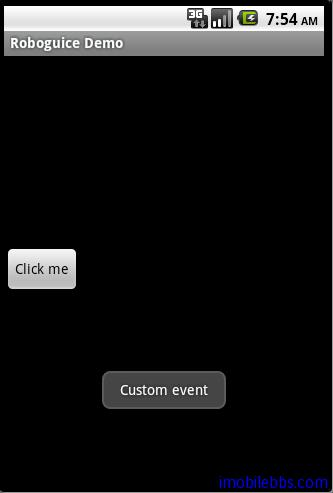

#發送接收Events

Roboguice 提供了對 Context 生命周期相關的事件的 send 和receive ,系統預設支持的事件為：

- OnActivityResultEvent
- OnConfigurationChangedEvent
- OnContentChangedEvent
- OnContentViewAvailableEvent
- OnCreateEvent
- OnDestroyEvent
- OnNewIntentEvent
- OnPauseEvent
- OnRestartEvent
- OnResumeEvent
- OnStartEvent
- OnStopEvent

一個簡單的例子如下：

```
public class MyActivity extends RoboActivity {
 // You must "register" your listener in the current
 // context by injecting it.
 // Injection is commonly done here in the activity,
 //but can also be done anywhere really.
 @Inject protected MyListeners myListeners;

}


// In this example, all the listeners are in a
// MyListeners class, but really they could
// be anywhere as long as it's registered.
// You can even put the listeners directly into
// your activity classes if you like!
class MyListeners {

 // Any method with void return type and a
 // single parameter with @Observes annotation
 // can be used as an event listener.
 //This one listens to onResume.
 public void doSomethingOnResume(
 @Observes OnResumeEvent onResume ) {
 Ln.d("Called doSomethingOnResume in onResume");
 }

 // As you might expect, some events can
 //have parameters.  The OnCreate event
 // has the savedInstanceState parameter that
 //Android passes to onCreate(Bundle)
 public void doSomethingElseOnCreate(
 @Observes OnCreateEvent onCreate ) {
 Ln.d("onCreate savedInstanceState is %s",
 onCreate.getSavedInstanceState())
 }

 // And of course, you can have multiple
 //listeners for a given event.
 // Note that ordering of listener execution
 //is indeterminate!
 public void xxx( @Observes OnCreateEvent onCreate ) {
 Ln.d("Hello, world!")
 }
}

```

有關 Events 的注意事項如下：

- 在Context中使用@Inject定義事件的Listener.
- Event只能在某一特定的Context（Activity）中傳送，不能跨Context發送，接受。
- Event除了提供上面列出的Context相關事件外，也可以使用自定義的事件。
- @observes 只能應用到方法上，而不能應用到構造函數上。

下面使用一個自定義事件 MyEvent，通過 observer 這個自定義事件來發送，接收自定義事件。

```
public class EventDemo extends RoboActivity {

 @Inject protected EventManager eventManager;
 @InjectView (R.id.button) Button button;

 @Override
 public void onCreate(Bundle savedInstanceState) {
 super.onCreate(savedInstanceState);
 setContentView(R.layout.eventdemo);
 button.setOnClickListener(mGoListener);
 }

 private OnClickListener mGoListener = new OnClickListener()
 {
 public void onClick(View v)
 {
 eventManager.fire(EventDemo.this,new MyEvent());
 }
 };


 protected void handleEvent(@Observes MyEvent event){
 Toast.makeText(this, "Custom event",
 Toast.LENGTH_LONG).show();
 }
}


class MyEvent{
 //put any memeber you want here.
}

```

