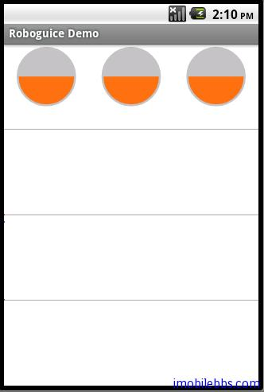

#Standard Injection

为方便起见，Roboguice 针对 Android 平台常用的一些对象或服务提供了“标准注入”支持。比如无需使用 (SensorManager) getSystemService(SENSOR_SERVICE) 来取得 SensorManger 实例，而直接使用 @Inject 标记

@Inject SensorManager sensorManager;

Roboguice 自动为 sensorManager 注入所需 SensorManger 对象， Roboguice 支持的标准注入有如下：

- @Inject ContentResolver contentResolver;
- @Inject AssetManager assetManager;
- @Inject Resources resources;
- @Inject LocationManager locationManager;
- @Inject WindowManager windowManager;
- @Inject LayoutInflater layoutInflater;
- @Inject ActivityManager activityManager;
- @Inject PowerManager powerManager;
- @Inject AlarmManager alarmManager;
- @Inject NotificationManager notificationManager;
- @Inject KeyguardManager keyguardManager;
- @Inject SearchManager searchManager;
- @Inject Vibrator vibrator;
- @Inject ConnectivityManager connectivityManager;
- @Inject WifiManager wifiManager;
- @Inject InputMethodManager inputMethodManager;
- @Inject SensorManager sensorManager;

我们使用 SensorManager 为例，说明一下 Standard Injection 的用法，本例基于 [Android ApiDemos示例解析(90):OS->Sensors](http://www.imobilebbs.com/wordpress/?p=1690) 。

修改

```
private SensorManager mSensorManager;
```

为

```
private @Inject
SensorManager mSensorManager;
```

去掉 onCreate 中的

```
mSensorManager = (SensorManager) getSystemService(SENSOR_SERVICE);

```

运行实例，可以看出不用使用 getSystemService，Roboguice 自动为mSensorManager 赋了值。



